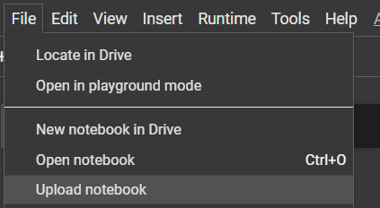
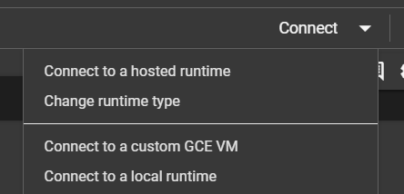
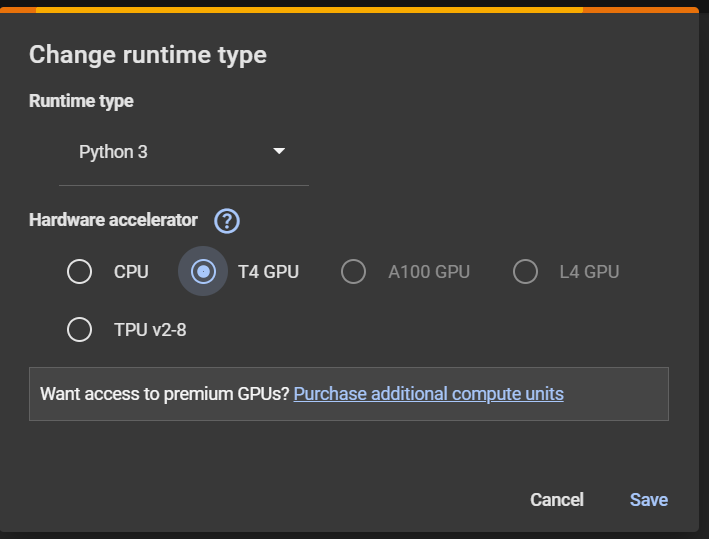
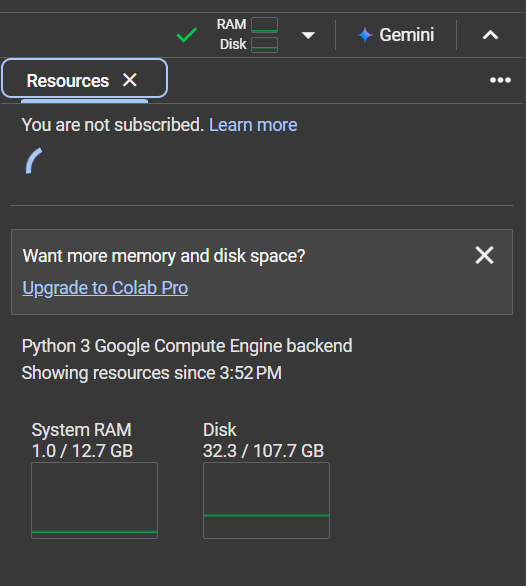

# Fine-tuning on Colab
## Introduction
This guide summarizes my learnings and experiences from using Colab for AI competitions. Please note that some information may change and may not always be up-to-date.

This repository is geared toward minimizing costs, so you don't need to worry about GPU expenses.

## Getting Started with Colab
### Create a new notebook

+ Access [Google Colab](https://colab.research.google.com/)
+ Sign in with your Google account
+ You can also upload your own `.ipynb` files
  + Go to **[File] > [Upload notebook]**.  
    
  + Alternatively, upload an `.ipynb` file to your Drive and open it in Colab.

### Enable GPU in Colab
+ Go to **[Runtime] > [Change runtime type]** and select **T4 GPU**.

<div style="display: flex; justify-content: space-between;background-color:grey;height:350px;">
    
    
</div>

### Available Resources
+ **Disk Space**:
  + 78 GB when using a GPU.
  + 107 GB when using only the CPU.
+ **RAM**: 12.72 GB.
+ **GPU**: T4 (15GB memory).
+ **Session Duration**: Up to 12 hours but may disconnect earlier if idle.
+ **Daily Usage**: Generally around 12 hours of GPU usage, depending on load.
+ **Idle Timeout**: Disconnects after 90 minutes of inactivity.

**Note**: From my experience, you can use a GPU for about 3–4 hours continuously.

You can check resources in the top-right corner of the Colab notebook. For more details, click on the resource monitoring window.  


## Working with Datasets
+ To use a dataset in your notebook:
  1. Upload it to your Drive.
  2. Mount your Drive to access the dataset:

     ```python
     from google.colab import drive
     drive.mount('/content/drive')
     ```

- Alternatively, use the Kaggle API to download datasets directly:

```bash
!pip install kaggle
!kaggle competitions download -c dataset_name
```

- Use the `!wget` command to download datasets directly into Colab:

```bash
!wget https://www.example.com/dataset.zip
```

## Saving and Accessing Outputs
Save outputs temporarily in Colab's workspace or permanently in Google Drive:

```python
model.save('/content/drive/My Drive/your_folder/model.h5')
```

## Fine-tuning on Colab
+ Find or develop a fine-tuning script for your model.
+ If your model is hosted on Hugging Face, you can often find Colab-compatible scripts directly on the model's page.
+ Many fine-tuning scripts tailored for Colab are available online.

### When GPU Resources Are Insufficient
+ Use resource-saving techniques like gradient accumulation, smaller batch sizes, and efficient memory management.
+ Available options include:
  + flash_attn 1.x
  + Mixed Precision (FP16)
  + qlora
  + int8 quantization (`bitsandbytes`)
+ Clear unused variables and use `torch.cuda.empty_cache()` to manage memory.
+ If resources are still insufficient, try a smaller or alternate model.

### Fine-tuning Strategy on Colab

+ Numerous fine-tuning scripts can be found on platforms like Medium and GitHub. However, these scripts often require adjustments to address compatibility issues with specific Python library versions.
+ Test the script on Colab to verify its functionality. If it runs successfully, it can be used for your work.
+ In most cases, you may need to modify the script, such as installing specific library versions, to ensure it operates correctly.
+ Colab is an excellent platform for debugging and refining scripts due to its daily GPU usage limit (3–4 hours of continuous use). This duration is generally sufficient for troubleshooting, though it may not support the full fine-tuning of large models.
+ Colab is also particularly suitable for fine-tuning smaller models or running inference scripts for larger models.

+ Here is the process for effectively utilizing Colab:
  1. **Locate or Develop a Fine-tuning Script**: Create your own or find one from sources like Hugging Face.
  2. **Test and Stabilize**: Run the script on Colab to ensure it works correctly and resolve any issues.
  3. **Use a Small Dataset**: Run the script with a small dataset on Colab to estimate the time and resources needed (especially GPU usage).
  4. **Scale Up Elsewhere**: Once the script is stable and resource needs are estimated, download it and execute it in an environment with more extensive GPU availability.
  5. **Inference with Colab**: Import the trained weights into Colab to perform inference on your test/validation datasets.
  6. **Fine-tune Small Models**: Colab can also be used to fine-tune smaller models entirely.

## Helpful Tips
+ Try different learning rates and batch sizes for small models, utilizing multiple Colab accounts if needed to maximize experimentation.
+ Prevent progress loss due to GPU time limits by saving model weights after each epoch, either manually or through automated scripts.
+ Uploading data to Colab can be time-consuming, so plan your schedule to accommodate this step effectively.
