# How to finetune on Kaggle
## Introduction
This is just a summary of what I have learned and experienced from using Kaggle for AI competitions.  
The information in this may not be accurate or up-to-date.

Especially, this repo is for broke people (just like me). So no need to worry about the cost of the GPU.
## Get started with Kaggle
### Set up Kaggle
+ Create your own account 
+ Need to verify your identity, you can follow these steps:
    + Go to your profile
    + Go to Settings
    + Phone verification: Add your phone number and verify it
    + Identity verification: Scan your face
### Create a new notebook
+ You can try to create your first notebook, simply by click [Create] -> [New Notebook]
+ You can use simple shortkey and magic just like in ipynb
+ Kaggle automatically saves your notebook
+ You can also upload your own ipynb file

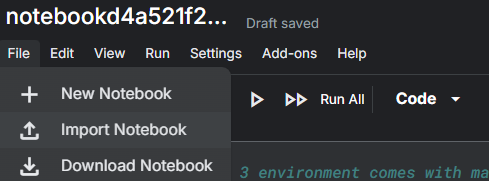
### Enable GPU in Kaggle
If you get stuck from using GPU in Kaggle, this is how you can enable it:
+ First, you **MUST** vefiry you identity (see [above](#set-up-kaggle))
+ Then, go back to your notebook, you can turn on your GPU in two ways:

**First way:**  
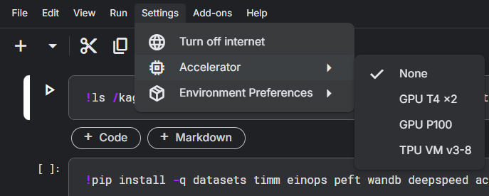

Go to [Settings] -> [Accelerator] -> [GPU]

**Second way:**  
+ Click the lower right corner button.

    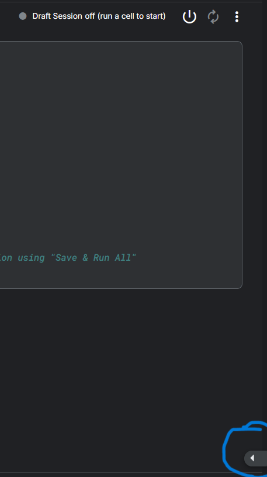

 
+ You can enable your gpu through [session options] -> [accelerator]

    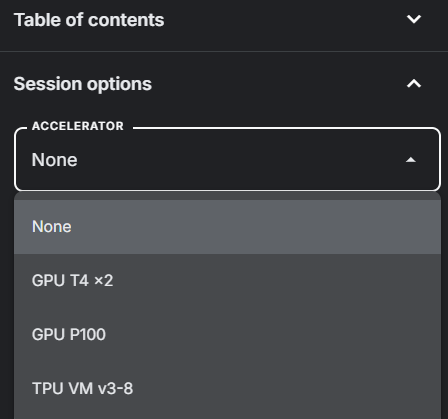

 

### Available resources
+ Accelerator:
    + GPU T4 *2 (15GB each)
    + GPU P100 (16GB)
    + TPU VM v3-8
    + 30 hours/week
    + Reset every week on Saturday
+ Disk: HDD 58GB 
+ RAM: 29GB
+ CPU: 4 cores 

+ Maximum time for each session: 12 hours

+ You can check your resources usage in the right top corner of your notebook (you will see this once you start running a session)
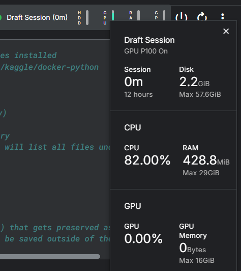
### Dataset
+ You can only use your dataset after you have uploaded it to Kaggle
+ [Create] -> [New Dataset]
+ Then you can upload your own dataset (you should zip it first if it is too large)
+ Then in you notebook, click [Add Input]

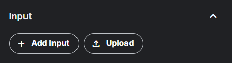

+ Tick [Your Work] + [Datasets]

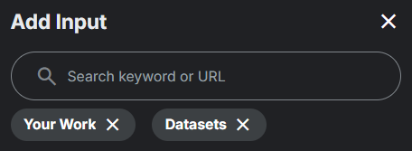

+ Then click plus sign to add you dataset (make sure that your dataset have already been uploaded successfully)

+ By default, your input will be in `/kaggle/input` of [Input]
### Save and Outputs
+ By default, when you download or create a file/folder, it will appear in `/kaggle/working` of [Output]  
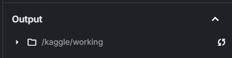  
+ You can save your output by clicking [Save Version]  
  
+ Fill version name, change version type to [Quick Save] and change save output to [Always save output when creating Quick Save]  

    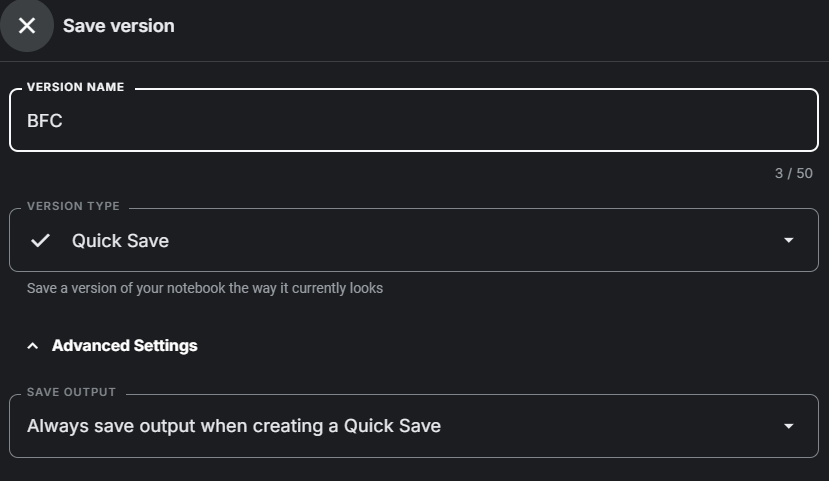

+ Waiting for the file to be saved  

+ Click on it when done, then switch to output tab then download the output files  
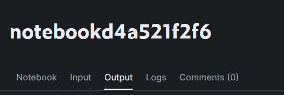
+ *Note* that you can also download some lightweight output files directly from the output tab in your notebook.

### Finetune on Kaggle 

+ Find a script for finetuning your model (you can write it yourself or find it on hugging face and other sources)
+ Make sure the model and finetune script fits in the available resources
+ You can check the required resources in HuggingFace model hub if you get the finetune script from there
+ If you get the script from other sources, you can check the required resources by running the script to estimate the resources needed

#### Kaggle Note 
+ Remember to apply techniques to reduce the resources needed (e.g. gradient accumulation, reduce batch size, etc.)
+ Note that for now, you can only use 2x T4 GPUs at most in Kaggle, so that means you cannot use flash_attn 2.x, bfloat16, etc 
+ However you can still use:
    + flash_attn 1.x
    + qlora 
    + int8 quantization (`bitsandbytes`)
+ Remember to utilize the 2nd GPU if the script supports it

#### What to do when the out of GPU
+ Remember to apply techniques to reduce the resources needed (e.g. gradient accumulation, reduce batch size, etc.)
+ Remember to utilize the 2nd GPU if the script supports it
+ Note that for now, you can only use 2x T4 GPUs at most in Kaggle, so that means you cannot use flash_attn 2.x, bfloat16, etc 
+ However you can still use:
    + flash_attn 1.x
    + Use Mixed Precision (FP16)
    + qlora 
    + int8 quantization (`bitsandbytes`)
    + etc
+ Clear Unused Variables and Use `torch.cuda.empty_cache()`
+ If all the above methods do not work, you can try with a smaller model or use a different model

#### Finetune strategy for Kaggle
+ If your model is very large, but you still can finetune it, you should finetune it epoch by epoch
+ This can save you a lot of resources, also help you to monitor the training process and avoid overfitting
+ To be more specific, here how I do it in Kaggle:
    + First, I finetune the model for 1 epoch
    + Save the model weight and optimizer state
    + Inference on val set (optional)
    + Restart the notebook and then use the saved weight and optimizer state to continue the training
    + Continue this process until you reach the desired number of epochs or get overfitting
+ Note that you can avoid downloading the weight and upload it back to Kaggle by:
    + Save the weight and optimizer state in the output folder (Quick Save)
    + In the output tab of the notebook, click [New dataset]
    

        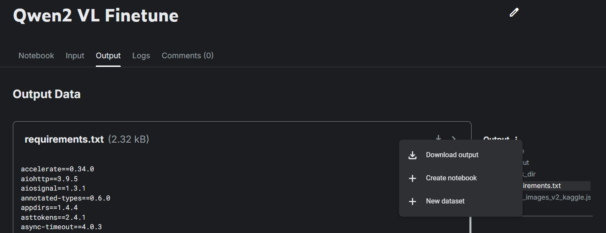
    

    
    + Then you can use the dataset in your finetune notebook again by adding the dataset to the input
    + This can save you a lot of time
    + If you want to use the old output file, you can check version and choose the version you want to save the output file
    

        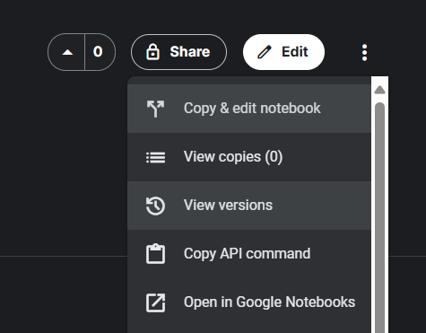
        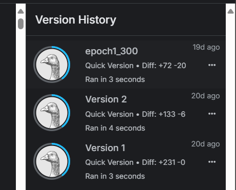
    

+ Another way to save time from downloading and uploading the weight: 
    + You can [Save and Run All (Commit)] your notebook
    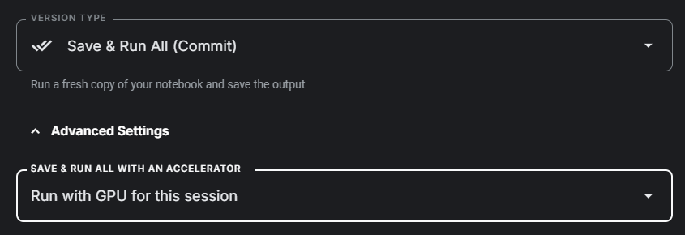
    + In your notebook, click [Add Input] and tick [Your Work] + [Notebooks], then choose the notebook you just run
    + Then you access the output file like normal 
    + With this way, you don't evenly need to create a new dataset every time you run, but you can't select the version of the output file (with the default version is the latest one)

### Some tips
+ If you are running your notebook, and want to stop it but don't want to lose the progress, you can change the [Persistence] to [Variables and Files] then stop the notebook
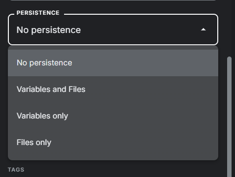
+ When you [Save and Run All (Commit)] your notebook, you can see a progress bar at the bottom of the notebook (on the notebook that you save and run), this progress bar will show you the output of the current cell. Taking advantage of that, you can minimize the window (small enough to see the progress bar), along with other finetune window, so you can monitor the finetune process of many scripts at the same time.
+ You actually can share dataset with other people (without publishing it), this will save a lot of time when you need to upload many datasets. You can also share notebook with other people. 
