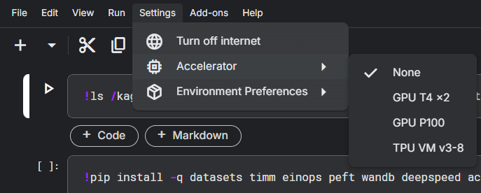
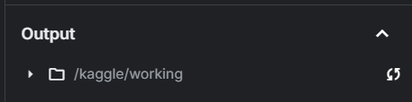
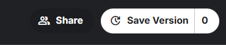
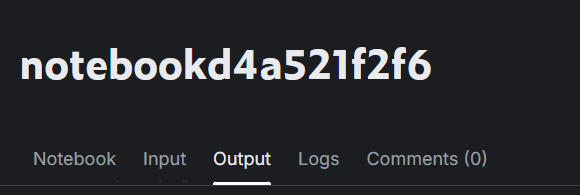
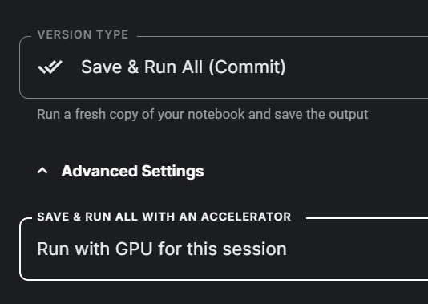
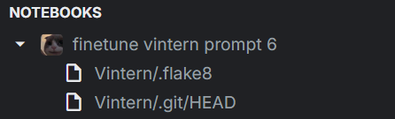
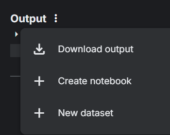

# Getting Started with Kaggle
## Setting Up Kaggle

1. **Create an Account**: Register for an account on Kaggle.
2. **Identity Verification**:
   - Go to **Profile > Settings**.
   - Complete **Phone Verification** by adding and verifying your phone number.
   - Complete **Identity Verification** by scanning your face.

## Creating a New Notebook

- Create your first notebook by selecting **Create > New Notebook**.
- Kaggle notebooks support Jupyter-style shortcuts and magic commands.
- Notebooks save automatically, and you can upload your own `.ipynb` files.

## Enabling GPU in Kaggle
To enable GPU in your Kaggle notebook, follow these steps:

1. **Verify Identity**: Ensure you have completed identity verification as described [above](#setting-up-kaggle).

2. **Enable GPU**: You have two options to activate the GPU in your notebook:

   - **Option 1**:
     - Open **Settings** in your notebook.
     - Under **Accelerator**, select **GPU**.

- **Option 2**:
  - Click the button in the lower right corner of your notebook interface.
  - In **Session Options**, go to **Accelerator** and select **GPU**.

    
    

## Available Resources

- **Accelerator Options**:
  - 2x GPU T4 (15GB each), GPU P100 (16GB), TPU VM v3-8
  - 30 hours per week, reset every Saturday
- **System Specs**:
  - Disk: HDD 58GB
  - RAM: 29GB
  - CPU: 4 cores
- **Session Limit**: 12 hours per session

Resource usage can be monitored in the top-right corner of the notebook.  

## Working with Datasets

- To use a dataset in your notebook, you first need to upload it to Kaggle.
- Go to **Create > New Dataset** and upload your dataset. For large files, consider zipping them before uploading.
- In your notebook, select **Add Input** to access your uploaded dataset.

   

- Check **Your Work** and then **Datasets** to view your uploaded datasets.

   

- Click the plus sign to add your dataset (ensure it has been successfully uploaded).

- Once added, your dataset will be available in the `/kaggle/input` directory by default.

## Saving and Accessing Outputs

- By default, any files or folders you download or create in the notebook are stored in `/kaggle/working` under **Output**.  
    

- To save your output, click **Save Version**.  
    

- Enter a version name, set the version type to **Quick Save**, and configure the save output setting to **Always save output when creating Quick Save**.  
  

      
  

- Wait for the save process to complete.  
  

- Once completed, you can go to the **Output** tab, locate your files, and download them.  
  

- *Note*: You can directly download smaller output files from the output tab in your notebook.

## Run All + Recurrent Workflow

If you want to use the output of your notebook as the input for the same notebook, follow these steps: 

1. **Save and Run All**: Ensure your notebook runs successfully by using the **Save and Run All (Commit)** option. This will execute the notebook and save the outputs in one step. Remember to turn on the GPU before running the notebook.

2. **Add Input**: After the notebook has run successfully, click **Add Input** and select **Your Work > Notebooks**. Choose the notebook you just ran.
Here is an example of how the notebook will look after running and adding the input:

3. **Access Output Files**: You can access the output files directly without creating a new dataset each time. However, this method defaults to the latest version of the output files.

4. **Save as Dataset** (Alternative): 
You can also save the output files as a dataset by clicking **New Dataset** in the **Output** tab. This will create a reusable dataset with the saved outputs.
