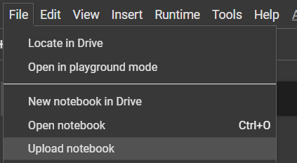
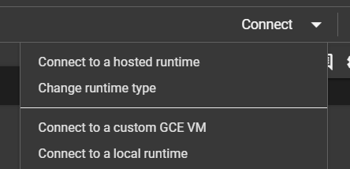

# Getting Started with Colab
## Create a new notebook

+ Access [Google Colab](https://colab.research.google.com/)
+ Sign in with your Google account
+ You can also upload your own `.ipynb` files
  + Go to **[File] > [Upload notebook]**.  
    
  + Alternatively, upload an `.ipynb` file to your Drive and open it in Colab.

## Enable GPU in Colab
+ Go to **[Runtime] > [Change runtime type]** and select **T4 GPU**.

<div style="display: flex; justify-content: space-between;background-color:grey;height:350px;">
    
    
</div>

## Available Resources
+ **Disk Space**:
  + 78 GB when using a GPU.
  + 107 GB when using only the CPU.
+ **RAM**: 12.72 GB.
+ **GPU**: T4 (15GB memory).
+ **Session Duration**: Up to 12 hours but may disconnect earlier if idle.
+ **Daily Usage**: Generally around 12 hours of GPU usage, depending on load.
+ **Idle Timeout**: Disconnects after 90 minutes of inactivity.

**Note**: From my experience, you can use a GPU for about 3–4 hours continuously.

You can check resources in the top-right corner of the Colab notebook. For more details, click on the resource monitoring window.  


## Working with Datasets
+ To use a dataset in your notebook:
  1. Upload it to your Drive.
  2. Mount your Drive to access the dataset:

     ```python
     from google.colab import drive
     drive.mount('/content/drive')
     ```

- Alternatively, use the Kaggle API to download datasets directly:

```bash
!pip install kaggle
!kaggle competitions download -c dataset_name
```

- Use the `!wget` command to download datasets directly into Colab:

```bash
!wget https://www.example.com/dataset.zip
```

## Saving and Accessing Outputs
Save outputs temporarily in Colab's workspace or permanently in Google Drive:

```python
model.save('/content/drive/My Drive/your_folder/model.h5')
```
