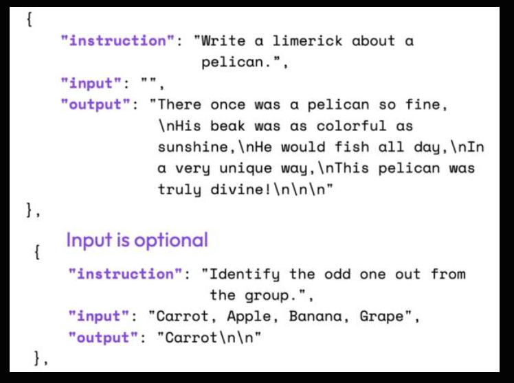

# Finetuning LLMs with LoRA and QLoRA: Insights from Hundreds of Experiments
Link: [here](https://lightning.ai/pages/community/lora-insights/#toc1)

## Introduction: Getting the Most out of LoRA
**Goal**: To provide practical insights for those interested in applying LoRA for fine-tuning LLMs.
*   The article aims to address questions about the value of QLoRA, whether to replace AdamW with SGD, the use of learning rate schedulers, and LoRA hyperparameter adjustments.

## Evaluation Tasks and Dataset

**TruthfulQA Scoring**:
*   The TruthfulQA benchmark reports two scores:
    *   **MC1 (Single-true)**: Measures simple accuracy by selecting the most likely answer from 4-5 choices.
    *   **MC2 (Multi-true)**: Measures the normalized total probability assigned to a set of true answers given a question.
*   For reference, the 175B GPT-3 model has TruthfulQA MC1 and MC2 values of 0.21 and 0.33, respectively.

**Arithmetic Task Examples**:
*   **Arithmetic 2ds**: Example: "What is 59 minus 38?". Expected answer: "21".
*   **Arithmetic 4ds**: Example: “What is 2762 plus 2751”. Expected answer: "5513".

**Training Dataset: Alpaca Dataset**:
*   The Alpaca dataset was used for supervised instruction finetuning.
*   It consists of approximately **50k instruction-response pairs**.
*   The median length of the input size is **110 tokens** using the Llama 2 SentencePiece tokenizer.

## Code Framework

**Lit-GPT Repository**:
*   The custom LLM finetuning code used for the experiments is based on the open-source Lit-GPT repository.
*   A more detailed guide can be found in the Lit-GPT tutorials section.

## Choosing a Good Base Model

Selecting Llama 2 7B:
*   The author decided that selecting the smallest of the remaining models would provide the most room for improvement while maintaining lower hardware requirements.
*   Therefore, the remainder of the article focuses on the **Llama 2 7B** model.

**Hardware**: All experiments were run on a single A100 GPU.

## Evaluating the LoRA Defaults

*   **Default LoRA Hyperparameters**: The following default settings were used for the initial LoRA fine-tuning evaluation:
    *   `learning_rate = 3e-4`
    *   `batch_size = 128`
    *   `micro_batch_size = 1`
    *   `max_iters = 50000`
    *   `weight_decay = 0.01`
    *   `lora_r = 8`
    *   `lora_alpha = 16`
    *   `lora_dropout = 0.05`
    *   `lora_query = True`
    *   `lora_key = False`
    *   `lora_value = True`
    *   `lora_projection = False`
    *   `lora_mlp = False`
    *   `lora_head = False`
    *   `warmup_steps = 100`

*   **Trainable Parameters**:
    *   With these settings, **4,194,304 LoRA parameters** were trained.
    *   The total number of trainable parameters in the base model is **6,738,415,616**.

*   **Training Time and Memory Usage**:
    *   The training took approximately **1.8 hours** on a single A100 GPU.
    *   The maximum memory usage was **21.33 GB**.

*  **Consistency of Results**: The experiment was repeated three times to observe the variance, and the performance was found to be very consistent and stable across runs.
*   **Performance Observations**:
    *   The LoRA default model became "really bad" at arithmetic. This was attributed to the Alpaca dataset not containing many arithmetic tasks.

*   **Comparison with Meta's Llama 2 Chat Model**:
    *   The performance of the 7B Llama 2 version that was instruction-finetuned by Meta using RLHF was also examined.
    *   Meta's Llama 2 Chat model also showed worse arithmetic performance.
    *   However, the Chat model performed much better on other benchmarks (except BLiMP), which served as a performance reference for the LoRA fine-tuning experiments.

## Memory Savings with QLoRA

**Experimental Setup**
*   Two quantization types were tested: 4-bit Normal Float (`bnb.nf4`) and 4-bit Floating Point (`bnb.fp4`).
*   The results were compared to default LoRA with bfloat-16 precision.

**Impact on Training Time and Memory Usage**:
*   **Default LoRA (with bfloat-16):**
    *   Training time: 6685.75 seconds
    *   Memory used: 21.33 GB
*   **QLoRA via `--quantize "bnb.nf4"`:**
    *   Training time: 10059.53 seconds
    *   Memory used: 14.18 GB
*   **QLoRA via `--quantize "bnb.fp4"`:**
    *   Training time: 9334.45 seconds
    *   Memory used: 14.19 GB
*   **Key Observation:** QLoRA decreased memory requirements by almost 6 GB, but increased training time by approximately 30% due to quantization and dequantization steps.

**Impact on Model Performance**:
*   QLoRA had a small impact on model performance compared to regular LoRA.
*   The model improved on the arithmetic benchmarks.
*   The model's performance declined on the MMLU Global Facts benchmark.

## Learning Rate Schedulers and SGD

**Background on AdamW**:
*   The AdamW optimizer was used for previous experiments as it's a common choice for LLM training.
*   AdamW can be memory-intensive because it tracks two additional parameters (moments *m* and *v*) for each model parameter.

**Motivation for Exploring SGD**:
*   The author explores whether swapping AdamW with an SGD optimizer could be beneficial, particularly in terms of memory usage.
*   SGD optimizers require a learning rate scheduler, and a cosine annealing schedule was chosen.

**Memory Savings Comparison**:
*   **AdamW:** 14.18 GB memory usage
*   **SGD:** 14.15 GB memory usage
*   **Observation:** Swapping AdamW with SGD resulted in only minor memory savings. This is attributed to the fact that most memory is used for matrix multiplications rather than optimizer states.
    *   The additional memory used by AdamW was calculated to be about 16.78 megabytes for the given LoRA configuration (r=8), which does not account for the small measured difference.
*   **Note:** A larger difference in memory usage between AdamW and SGD is expected when using a larger LoRA rank `r` value, due to the larger number of trainable parameters.

## LoRA Hyperparameter Tuning

**Part 1: LoRA for All Layers**

*   **Initial Setup**: By default, LoRA was only enabled for the Key and Query matrices within the multi-head self-attention blocks.
*   **Change**: This experiment involves enabling LoRA for all layers of the model, including the Value matrix, projection layers, and linear layers.
*   **Impact:** The blog post does not include specific performance results in this part, but rather sets the stage for the following experiments which will test different values for `r` and `alpha`. The point of the change was to enable more trainable parameters which will be investigated in the next section.

**Part 2: Increasing R**

*   **Introduction to 'r'**: The parameter "r" determines the rank or dimension of the LoRA matrices, which directly influences the model's complexity and capacity. A higher "r" means more expressive power but can lead to overfitting, while a lower "r" can reduce overfitting at the expense of expressiveness.
*   **Experiment**: The author increased the value of `r` from 8 to 16, keeping LoRA enabled for all layers.
*   **Result**: Increasing `r` from 8 to 16 resulted in **worse performance**. The author notes that this result prompted further investigation of the alpha parameter.

**Part 3: Changing Alpha**

*   **Introduction to 'alpha'**: The parameter "alpha" is used to place more emphasis on the low-rank structure or regularization. A higher "alpha" would place more emphasis on the low-rank structure or regularization, while a lower "alpha" would reduce its influence, making the model rely more on the original parameters.
*   **Rule of Thumb**: It is common practice to set alpha to twice the size of the rank ("r") when fine-tuning LLMs.
*   **Experiment**: The author increased "alpha" two-fold from 16 to 32 when `r` was set to 16.
*   **Result**: Increasing "alpha" to 32 resulted in the **best model performance** up to that point. This improvement, however, came with an increase in the number of trainable parameters, as well as memory usage, though the increase was not substantial.
*  **Additional Experiments:** The author ran experiments with exceptionally large ranks (512, 1024, and 2048) which resulted in poorer outcomes, which were excluded from the table.
*  **Importance of alpha**: Experiments with an alpha of 1 showed that a large alpha value was necessary for good performance. The author also repeated experiments with alpha values of 16 and 32, and found worse performance compared to choosing the alpha value as two-times the rank.

**Part 3: Very Large R**

*   **Experiment:** The author further optimized the alpha value of the best model from the previous section (r=256), suspecting that the default setting (alpha=512) might be a bit too large.
*   **Finding**:  Choosing a large alpha value appears to be crucial when increasing the rank, and an alpha value of two times the rank yielded the best results.
*   **Result:** Choosing an alpha value such that it exceeds the “two-fold the rank” recommendation also makes the benchmark outcomes worse.

## Conclustion

This article explored the various knobs we can tune when training custom LLMs using LoRA. We found that QLoRA is a great memory-saver even though it comes at an increased runtime cost. Moreover, while learning rate schedulers can be beneficial, choosing between AdamW and SGD optimizers makes little difference. And iterating over the dataset more than once can make the results even worse. The best bang for the buck can be achieved by optimizing the LoRA settings, including the rank. Increasing the rank will result in more trainable parameters, which could lead to higher degrees of overfitting and runtime costs. However, when increasing the rank, choosing the appropriate alpha value is important. 

