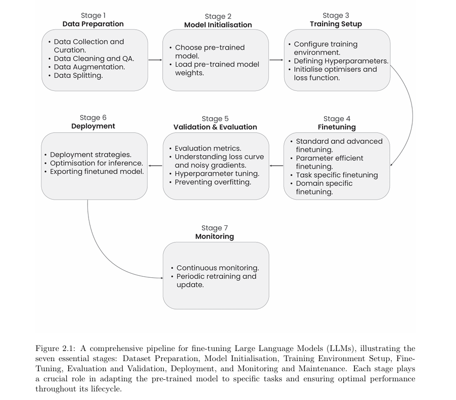
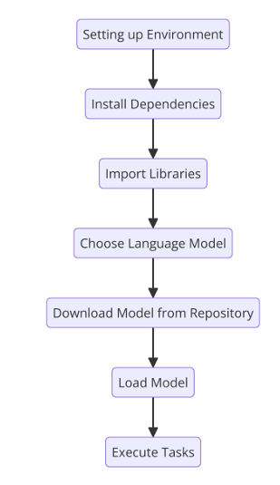

# The Ultimate Guide to Fine-Tuning LLMs from Basics to Breakthroughs: An Exhaustive Review of Technologies, Research, Best Practices, Applied Research Challenges and Opportunities

**Source**: [original paper](https://arxiv.org/pdf/2408.13296v1) and many online sources

**Note**: This is a summary of what I've learned and understood from the original papers. I've also included additional information collected from online sources.

## TL;DR
+ Chapter 1: 
    - Type of LLMs: Unsupervised, supervised and instruction tuning.
    - RAG
+ Chapter 2:

    

+ Chapter 3: Data Preprocessing + Data Augmentation
+ Chapter 4: Model Architecture

    

+ Chapter 5: GPUs, hyperparameters, and optimizer and loss function for training.
+ Chapter 6: Fine-Tuning techniques:
    + Task/Domain specific fine-tuning
    + PEFT: Adapter, Lora, Qlora, Dora.
    + Half Fine-Tuning
    + MoE&MoA
+ Chapter 7: Evaluation Metrics
    1. Set Up Evaluation Metrics
    2. Interpret Training Loss Curve
    3. Run Validation Loops
    4. Monitor and Interpret Results
    5. Hyperparameter Tuning and Adjustments
+ Chapter 11: Multimodal LLMs and their Fine-tuning